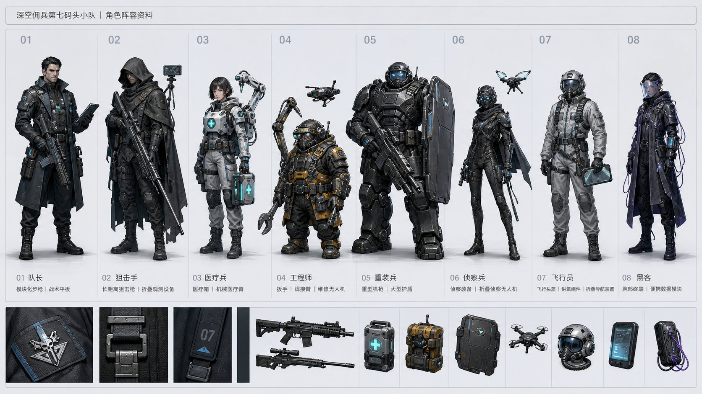
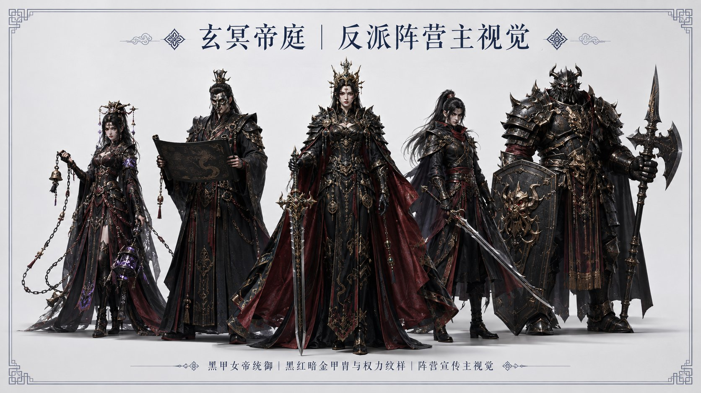
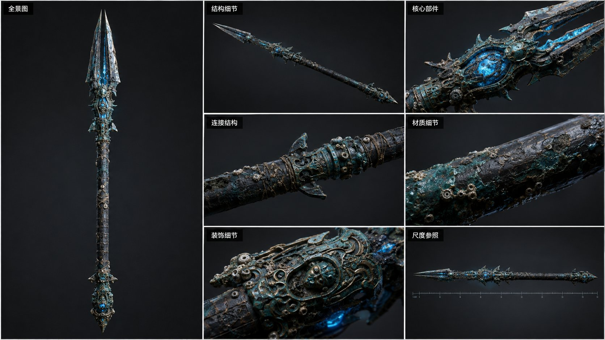
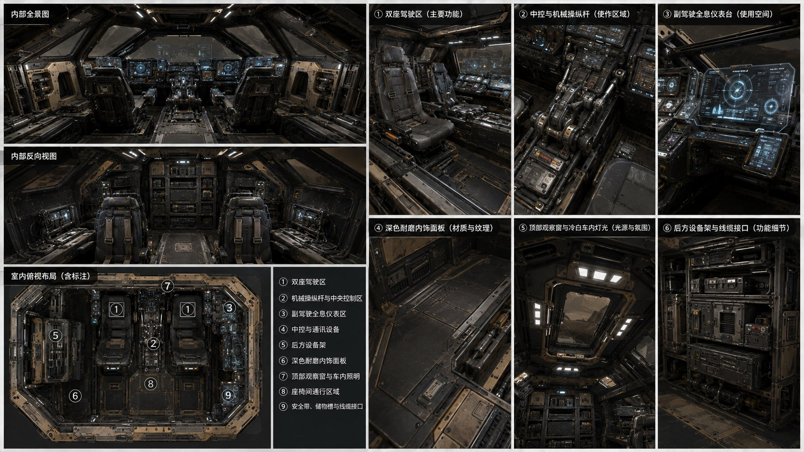
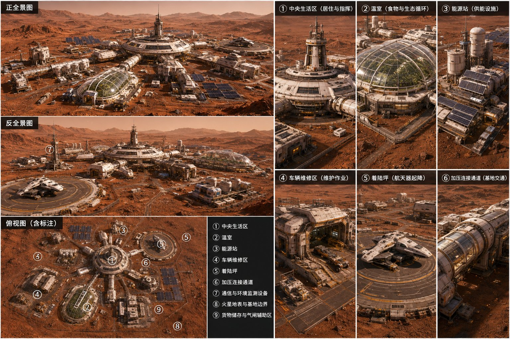
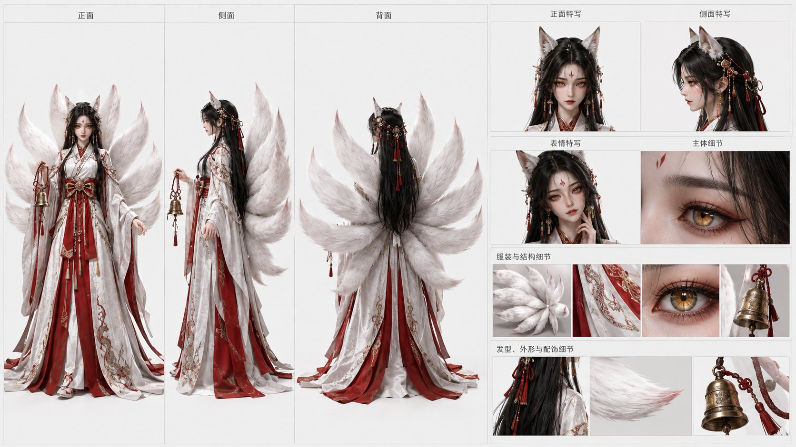
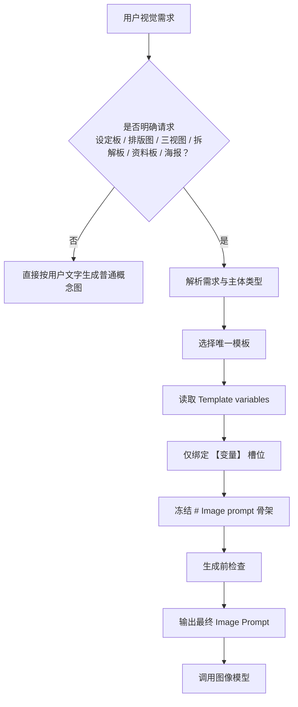

<p align="center">
  
</p>

<h1 align="center">prompt-to-image v0.4</h1>

<p align="center">
  将自然语言视觉需求稳定路由为高质量设定板、资料板与排版图的 Prompt Engineering Skill。
</p>

<p align="center">
  <a href="./LICENSE"></a>
  
  
  
</p>

<p align="center">
  <strong>严格模板路由 · 变量绑定 · 版式冻结 · 稳定输出</strong>
</p>

<p align="center">
  免费开源 · MIT License
</p>

---

## 项目简介

直接让 AI 生成「三视图」「角色资料板」「阵营 KV」「载具设定图」时，常会遇到版面随机、信息层级混乱、标签错位，以及多参考图特征被平均融合等问题。

**prompt-to-image** 以「严格模板路由 + 变量绑定 + 版式冻结 + 执行协议」为核心，将自然语言需求映射到固定视觉模板，帮助图像模型按预设结构生成角色、群像、道具、载具、场景与室内空间等专业设定资料板。

> 它的目标不是让模型“更会写 Prompt”，而是减少关键结构上的自由改写，提高复杂视觉设定任务的稳定性与可复现性。

## 目录

- [项目简介](#项目简介)
- [效果展示](#效果展示)
- [核心能力](#核心能力)
- [工作流](#工作流)
- [支持模板](#支持模板)
- [使用方法](#使用方法)
- [项目结构](#项目结构)
- [核心原则与约束](#核心原则与约束)
- [适用场景](#适用场景)
- [License](#license)
- [作者](#作者)

## 效果展示

<table>
  <tr>
    <td align="center" width="50%">
      
      <br><strong>角色 / 雇佣兵设定</strong>
    </td>
    <td align="center" width="50%">
      
      <br><strong>角色设定资料板</strong>
    </td>
  </tr>
  <tr>
    <td align="center">
      
      <br><strong>道具 / 武器结构设定</strong>
    </td>
    <td align="center">
      
      <br><strong>驾驶舱 / 室内空间设定</strong>
    </td>
  </tr>
  <tr>
    <td align="center">
      
      <br><strong>火星基地 / 环境设定</strong>
    </td>
    <td align="center">
      
      <br><strong>生物 / 角色设定</strong>
    </td>
  </tr>
</table>

> Gallery 自动收录仓库根目录中的全部 `example-*.jpg` 示例资源。

## 核心能力

- **唯一模板路由**：只在用户明确请求设定板、排版图、三视图、拆解板、资料板或海报时进入模板路由；普通概念图或普通图片直接按文字生成。
- **受控变量绑定**：仅替换模板中的 `【变量】` 槽位，优先使用用户明确提供的信息与指定主参考图。
- **版式冻结**：以各模板 `# Image prompt` 下的代码块作为唯一提示词骨架，避免生成前后的结构漂移。
- **冲突优先级**：安全政策、用户明确结构、模板约束、主体事实、风格偏好、主参考图、其他参考图与模型推断依次生效；低优先级不得覆盖高优先级。
- **生成前检查**：确认唯一模板、唯一 Image Prompt、仅变量绑定，以及主体身份、比例、材质、参考图和版式要求均被保留。

## 工作流



当封闭空间未说明内部或外部时，Skill 会先询问「需要生成内部场景还是外部场景？」；若无法确定模板，则不强制套用，而是询问用户希望生成单张概念图、场景设定板、空间拆解板还是资产设计板。

## 支持模板

| 模板 | 适用内容 | 典型输出 |
|---|---|---|
| [`character-sheet`](./references/character-sheet.md) | 单个角色、生物、机甲生命体 | 三视图、表情、局部细节 |
| [`group-lineup-sheet`](./references/group-lineup-sheet.md) | 群像资料板、阵营档案 | 多人并列、身份标注 |
| [`group-poster-sheet`](./references/group-poster-sheet.md) | 群像宣传海报、阵营 KV | 主视觉、宣传排版 |
| [`prop-sheet`](./references/prop-sheet.md) | 武器、装备、饰品、机械物件 | 全景、结构、材质细节 |
| [`vehicle-sheet`](./references/vehicle-sheet.md) | 汽车、飞机、船舶、飞船、机甲载具 | 多视图、结构、剖面 |
| [`environment-sheet`](./references/environment-sheet.md) | 建筑外部、场地、自然环境 | 全景、分区、功能标注 |
| [`interior-sheet`](./references/interior-sheet.md) | 驾驶舱、客舱、房间等封闭空间 | 空间全景、功能区拆解 |

## 使用方法

本 Skill 适用于支持 Markdown Skill / Agent Skill 机制的 AI 平台或工作流。

1. 将完整的 `prompt-to-image-v0.4` 目录放入对应平台的 Skill 目录。
2. 使用自然语言描述希望生成的视觉内容。
3. Skill 完成需求识别、模板路由、变量绑定与 Prompt 冻结，并输出最终 Image Prompt。

示例：

```text
生成一张赛博朋克雇佣兵小队的群像资料板
```

```text
做一把外星科技仪式长矛的设定图，需要结构拆解
```

```text
画一个火星基地的全景设定板，并标注主要功能区
```

```text
设计一艘深空运输舰，需要侧视图、俯视图和结构剖面
```

## 项目结构

```text
prompt-to-image-v0.4/
├── SKILL.md                         # 主入口、优先级与路由逻辑
├── agents/
│   └── openai.yaml                  # Agent 配置
├── references/
│   ├── character-sheet.md           # 单角色设定模板
│   ├── group-lineup-sheet.md        # 群像资料板模板
│   ├── group-poster-sheet.md        # 群像海报模板
│   ├── prop-sheet.md                # 道具 / 武器模板
│   ├── vehicle-sheet.md             # 载具模板
│   ├── environment-sheet.md         # 环境 / 建筑模板
│   ├── interior-sheet.md            # 室内空间模板
│   ├── execution-protocol.md        # 执行协议
│   ├── routing-rules.md             # 路由规则
│   └── routing-tests.md             # 路由测试用例
├── cover.png                        # README Hero
├── example-*.jpg                    # 效果示例图
├── README.md
└── LICENSE
```

## 核心原则与约束

- 每次只选择**一个唯一模板**，避免不同版式规则相互污染。
- 发送给图像工具时，只发送已选 reference 中 `# Image prompt` 代码块的内容。
- 模板冻结后，不重新组织结构，也不二次润色提示词。
- 仅绑定 `【】` 槽位；模板的非占位文本、版式与约束不得任意拼接、删减、改写、扩写或替换。
- 多张参考图不可平均融合不同主体；文字信息优先于图片信息。
- 若图像工具无法可靠生成中文文字，优先保留标题区域、标签位置与版式层级；文字可近似或留作后处理。
- 不适用于 Logo、UI、普通图片编辑或文档插图。

## 适用场景

- 游戏角色与生物设定
- 动画 / 影视概念设计
- 世界观资料板与阵营档案
- 游戏道具、武器与装备设计
- 科幻载具设计
- 建筑、环境与场地概念设计
- 驾驶舱与室内空间设计
- AI 视觉工作流、Prompt Engineering 与 Concept Art Pipeline

## License

本项目采用 [MIT License](./LICENSE)，可自由使用、修改、分发与商业使用；具体条款见 LICENSE。

## 支持项目

如果支持，请点一下星号（Star）。  
得到帮助，请点一下星号（Star）。

## 作者

**砍做日**  
个人博客：[kanzuori.com](https://kanzuori.com)

如果这个项目对你的 AI 视觉工作流有帮助，欢迎 Star、Fork，并提交新的模板与案例。
